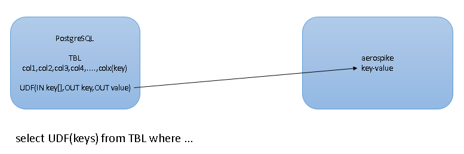

## PostgreSQL use UDF combine NoSQL DB's Computing Power  
                                                                                                                                                 
### 作者                                                                                                                                
digoal                                                                                                                                
                                                                                                                                
### 日期                                                                                                                                 
2015-07-22                                                                                                                     
                                                                                                                                  
### 标签                                                                                                                                
PostgreSQL , UDF , 整合      
                                                                                                                                            
----                                                                                                                                            
                                                                                                                                             
## 背景                                                                     
PostgreSQL数据库如何利用NoSQL数据库的强大计算能力或某些特性呢？  
  
这个问题实际上是因为一种数据库不可能做到适合任何场景，一个企业的不同业务类型可能使用的数据产品也千差万别。昨天和一位朋友聊到一个应用场景，他们有部分数据是存储在aerospike的，在aerospike中做BIT运算是很快的，但是当需要多个条件的组合时（多级索引），可能就不是那么适合了。  
  
这个时候PostgreSQL就派上用场了，将aerospike中的KEY存储到PostgreSQL中，还有多级索引涉及的字段内容也存储到PostgreSQL中，VALUE（bitmap）还是存储在aerospike中。  
  
这么做之后，原来的查询就变成PostgreSQL中的查询了，但是如何才能结合aerospike中的bit运算结果呢？这个时候需要使用PostgreSQL的UDF功能，参考本文参考部分，例如aerospike支持python，那么我们就在PostgreSQL中使用PL/python语言来编写这个UDF。  
  
  
  
使用UDF可以很好的调动外部数据源的计算能力。目前PostgreSQL支持多种语言的函数，例如C,python,perl,tcl,java,javascript,R等等。  
  
当然除了UDF，实际上PostgreSQL还有FDW，只是不是所有的数据源目前都有开源的FDW，所以UDF使用起来门槛更低，还有一点，并不是所有的查询FDW都支持where条件的push down，所以这个时候还是要靠UDF。  
  
目前PostgreSQL支持的FDW请参考：  
  
https://wiki.postgresql.org/wiki/Fdw  
  
UDF这种用法，其实在其他产品中也屡见不鲜，例如R的pivotalR包，也可以认为是一种UDF包，它实际上是在Greenplum或HAWQ中执行相应的SQL语句，并将数据返回给R，这正是R利用MPP的数据处理能力的一种手段。与本文在PostgreSQL中使用UDF利用aerospike的计算能力的思路是一样的。  
  
## 参考  
1\. http://www.postgresql.org/docs/9.4/static/plpython.html  
  
2\. http://www.postgresql.org/docs/9.4/static/server-programming.html  
  
3\. https://wiki.postgresql.org/wiki/Fdw  
  
  
  
  
  
  
  
  
  
  
  
  
  
  
  
  
  
  
  
  
  
  
  
  
  
  
  
  
  
  
  
  
  
  
  
  
  
  
  
  
  
  
  
  
  
  
  
  
  
  
  
  
  
  
  
  
  
  
  
  
  
  
  
  
  
  
  
  
  
  
  
  
  
#### [PostgreSQL 许愿链接](https://github.com/digoal/blog/issues/76 "269ac3d1c492e938c0191101c7238216")
您的愿望将传达给PG kernel hacker、数据库厂商等, 帮助提高数据库产品质量和功能, 说不定下一个PG版本就有您提出的功能点. 针对非常好的提议，奖励限量版PG文化衫、纪念品、贴纸、PG热门书籍等，奖品丰富，快来许愿。[开不开森](https://github.com/digoal/blog/issues/76 "269ac3d1c492e938c0191101c7238216").  
  
  
#### [9.9元购买3个月阿里云RDS PostgreSQL实例](https://www.aliyun.com/database/postgresqlactivity "57258f76c37864c6e6d23383d05714ea")
  
  
#### [PostgreSQL 解决方案集合](https://yq.aliyun.com/topic/118 "40cff096e9ed7122c512b35d8561d9c8")
  
  
#### [德哥 / digoal's github - 公益是一辈子的事.](https://github.com/digoal/blog/blob/master/README.md "22709685feb7cab07d30f30387f0a9ae")
  
  

  
  
#### [PolarDB 学习图谱: 训练营、培训认证、在线互动实验、解决方案、生态合作、写心得拿奖品](https://www.aliyun.com/database/openpolardb/activity "8642f60e04ed0c814bf9cb9677976bd4")
  
  
#### [购买PolarDB云服务折扣活动进行中, 55元起](https://www.aliyun.com/activity/new/polardb-yunparter?userCode=bsb3t4al "e0495c413bedacabb75ff1e880be465a")
  
  
#### [About 德哥](https://github.com/digoal/blog/blob/master/me/readme.md "a37735981e7704886ffd590565582dd0")
  
