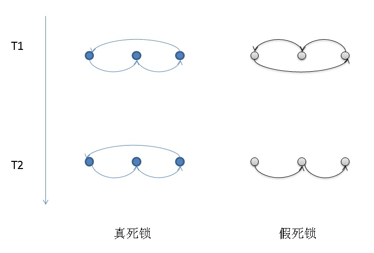

## PostgreSQL 如何检测分布式死锁 - postgrespro pg_shardman   
                                                                 
### 作者                                                                 
digoal                                                                 
                                                                 
### 日期                                                                 
2018-07-04                                                               
                                                                 
### 标签                                                                 
PostgreSQL , postgrespro , pg_shardman , 分布式死锁    
                                                                 
----                                                                 
                                                                 
## 背景   
单机的死锁检测是比较容易实现的，通过判断等待中的事务是否查询环状，即可实现。例如下面的图，A等B, B等C, C等A，出现环状，即认为死锁。  
  
  
  
而对于分布式事务，由于相互等待的事务可能出现在不同的数据节点上，如何判断分布式死锁呢？  
  
为了判断是否有环，必须引入全局事务号，或者有标识可以在每个数据节点上标识出来对应的事务。这样才能画出等待图形，判断是否出现环状。  
  
另一方面由于判断分布式事务是否出现死锁，在每个数据节点上读取锁等待信息，所以不同的数据节点读取等待信息是有时间差的，因此仅凭一次的环无法判断是否真的死锁（例如你在查询到等待后，查看其它节点时，实际上之前的等待已经消失的情况，是“假死锁”），需要两次查询，并且等待环（包括GID在内等信息完全一致的环）出现在两次查询中时，这个环才认为是真正的死锁。  
  
  
  
## postgrespro pg_shardman  
pg_shardman 没有内置死锁检测的功能，而是通过开放一个UDF接口，用户调用这个接口，无限循环，检测是否有分布式死锁，随机cancel造成分布式死锁的其中一个query。  
  
```  
monitor(check_timeout_sec int = 5, rm_node_timeout_sec int = 60)  
```  
  
Monitor cluster for presence of distributed deadlocks and node failures. This function is intended to be executed at shardlord and is redirected to shardlord been launched at any other node. It starts infinite loop which polls all clusters nodes, collecting local ```lock graphs``` from all nodes. Period of poll is specified by ```check_timeout_sec``` parameter (default value is 5 seconds). Local lock graphs are combined into global lock graph which is analyzed for the presence of loops. A loop in the lock graph means distributed deadlock. Monitor function tries to resolve deadlock by canceling one or more backends involved in the deadlock loop (using ```pg_cancel_backend``` function, which doesn't actually terminate backend but tries to cancel current query). Canceled backend is randomly chosen within deadlock loop. Since not all deadlock members are hanged in 'active query' state, it might be needed to send cancel several times.  
  
Since local graphs collected from all nodes do not form consistent global snapshot, false postives are possible: edges in deadlock loop correspond to different moment of times. To prevent false deadlock detection, monitor function doesn't react on detected deadlock immediately. Instead of it, previous deadlock loop located at previous iteration is compared with current deadlock loop and only if they are equal, deadlock is reported and resolving is performed.  
  
If some node is unreachable then monitor function prints correspondent error message and retries access until ```rm_node_timeout_sec``` timeout expiration. After it node is removed from the cluster using ```shardman.rm_node``` function. If redundancy level is non-zero, then primary partitions from the disabled node are replaced with replicas. Finally ```pg_shardman``` performs recovery of distributed transactions for which failed node was the coordinator. It is done using ```shardman.recover_xacts()``` function which collects status of distributed transaction at all participants and tries to make decision whether it should be committed or aborted. If ```rm_node_timeout_sec``` is ```NULL```, ```monitor``` will not remove nodes.  
  
## 参考  
https://github.com/postgrespro/pg_shardman/blob/native_partitioning/pg_shardman--0.0.3.sql  
  
pg_shardman提供的分布式死锁检测依赖的一些对象。    
   
```  
-- Type to represent vertex in lock graph  
create type process as (node int, pid int);  
  
-- View to build lock graph which can be used to detect global deadlock.  
-- Application_name is assumed pgfdw:$system_id:$coord_pid  
-- gid is assumed pgfdw:$timestamp:$sys_id:$pid:$xid:$participants_count:$coord_count  
-- Currently we are oblivious about lock modes and report any wait -> hold edge  
-- on the same object and therefore might produce false loops. Furthermore,  
-- we have not idea about locking queues here. Probably it is better to use  
-- pg_blocking_pids, but it seems to ignore prepared xacts.  
CREATE VIEW lock_graph(wait, hold) AS  
	-- local dependencies  
    -- If xact is already prepared, we take node and pid of the coordinator.  
	SELECT  
		ROW(shardman.get_my_id(),  
			wait.pid)::shardman.process,  
	 	CASE WHEN hold.pid IS NOT NULL THEN  
		    ROW(shardman.get_my_id(), hold.pid)::shardman.process  
		ELSE -- prepared  
			ROW(shardman.get_node_by_sysid(split_part(gid, ':', 3)::bigint),  
				split_part(gid, ':', 4)::int)::shardman.process  
		END  
     FROM pg_locks wait, pg_locks hold LEFT OUTER JOIN pg_prepared_xacts twopc  
			  ON twopc.transaction=hold.transactionid  
	WHERE  
		NOT wait.granted AND wait.pid IS NOT NULL AND hold.granted AND  
		-- waiter waits for the the object holder locks  
		wait.database IS NOT DISTINCT FROM hold.database AND  
		wait.relation IS NOT DISTINCT FROM hold.relation AND  
		wait.page IS NOT DISTINCT FROM hold.page AND  
		wait.tuple IS NOT DISTINCT FROM hold.tuple AND  
		wait.virtualxid IS NOT DISTINCT FROM hold.virtualxid AND  
		wait.transactionid IS NOT DISTINCT FROM hold.transactionid AND -- waiting on xid  
		wait.classid IS NOT DISTINCT FROM hold.classid AND  
		wait.objid IS NOT DISTINCT FROM hold.objid AND  
		wait.objsubid IS NOT DISTINCT FROM hold.objsubid AND  
		 -- this is most probably truism, but who knows  
		(hold.pid IS NOT NULL OR twopc.gid IS NOT NULL)  
	UNION ALL  
	-- if this fdw backend is busy, potentially waiting, add edge coordinator -> fdw  
	SELECT ROW(shardman.get_node_by_sysid(split_part(application_name, ':', 2)::bigint),  
			   split_part(application_name,':',3)::int)::shardman.process,  
		   ROW(shardman.get_my_id(),  
			   pid)::shardman.process  
	FROM pg_stat_activity WHERE application_name LIKE 'pgfdw:%' AND wait_event<>'ClientRead'  
	UNION ALL  
	-- otherwise, coordinator itself is busy, potentially waiting, so add fdw ->  
	-- coordinator edge  
	SELECT ROW(shardman.get_my_id(),  
			   pid)::shardman.process,  
		   ROW(shardman.get_node_by_sysid(split_part(application_name,':',2)::bigint),  
			   split_part(application_name,':',3)::int)::shardman.process  
	FROM pg_stat_activity WHERE application_name LIKE 'pgfdw:%' AND wait_event='ClientRead';  
  
-- Pack lock graph into comma-separated string of edges like "2:17439->4:30046",  
-- i.e. pid 17439 on node 2 waits for pid 30046 on node 4  
CREATE FUNCTION serialize_lock_graph() RETURNS TEXT AS $$  
	SELECT COALESCE(  
		string_agg((wait).node || ':' || (wait).pid || '->' ||  
				   (hold).node || ':' || (hold).pid,  
				   ','),  
		'')  
	FROM shardman.lock_graph;  
$$ LANGUAGE sql;  
```  
    
  
  
  
  
  
  
  
  
  
  
  
  
  
  
  
#### [digoal's PostgreSQL文章入口](https://github.com/digoal/blog/blob/master/README.md "22709685feb7cab07d30f30387f0a9ae")
  
  

  
  
  
  
  
  
  
  
#### [免费领取阿里云RDS PostgreSQL实例、ECS虚拟机](https://www.aliyun.com/database/postgresqlactivity "57258f76c37864c6e6d23383d05714ea")
  
