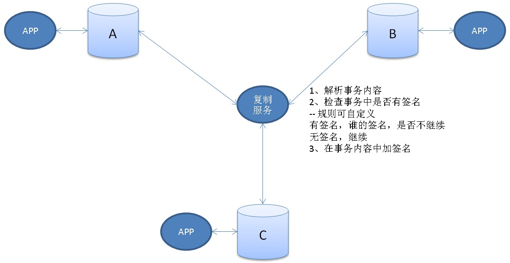

## multi-master - 多主 - 多写 - 如何在多写中避免数据复制打环(死循环)   
                                                                               
### 作者                                                                               
digoal                                                                               
                                                                               
### 日期                                                                               
2018-11-19                                                                           
                                                                               
### 标签                                                                               
PostgreSQL , 打环         
                                                                               
----                                                                               
                                                                               
## 背景     
双写或者多写，除了需要考虑数据冲突的问题，另一个要考虑的就是打环的问题。  
  
为什么会打环呢？  
  
```  
DB A <-> DB B  
```  
  
1、A  
  
```  
insert into tbl values (1,'test');  
  
产生redo  
  
同步到B  
```  
  
2、B  
  
```  
接收到同步内容  
  
insert into tbl values (1,'test');  
  
产生redo  
  
同步到A  
```  
  
3、。。。 。。。  
    
循环往复。  
  
## 如何解决多写复制打环呢？  
  
[《使用PostgreSQL逻辑订阅实现multi-master》](../201706/20170624_01.md)    
    
以上是在数据库源端使用标记来解决，记录数据是从哪个节点产生的，目标端回放时过滤掉打环的数据。  
  
如果你的复制是使用中间层做的，也可以使用类似方法解决。  
  
### 思路  
把一个事务理解为一个数据包。  
  
数据包有身份信息，例如是A库产生的还是B库产生的，我们只要能让REDO中携带这个事务是谁产生的这笔身份信息，并且在写到目标端后依旧能保留这份信息，就可以用来避免多写打环。  
  
### 实现介绍  
  
  
  
假设使用中间服务来进行PG的多主同步，源数据解析采用解析源库REDO的方式。例如pglogical  
  
https://github.com/2ndQuadrant/pglogical  
  
中间服务需要完成几件事情：  
  
1、解析上游节点的REDO，按事务处理  
  
2、检查一个事务中是否有签名信息(怎么检测，取决于第三步怎么加签名)。  
  
如果事务中有签名信息，这个事务的内容不传播给下游（即不在下游回放）。  
  
如果事务中没有签名信息，继续下一步（加签名信息）。  
  
3、在事务中加签名信息(事务的源库签名)。  
  
签名内容是什么？  
  
即这个事务的源头是哪个库（可以用数据库的systemid来表示，或者其他可以唯一标识一个库的ID（例如host+port+dbname））。  
  
怎么加签名？  
  
1、方法1，PG提供了custom wal record的接口，可以在目标库回放这个事务时，在事务结束前，把custom wal record(值为事务的源库签名)加到这个事务中。    
  
具体请参考文档   
  
https://www.postgresql.org/docs/11/generic-wal.html  
  
2、方法2，在事务结束前，在目标库通过写数据产生REDO实现，值为(事务的源库签名)。  
  
例如，  
  
```  
create table 签名表 (id serial8 primary key, info text);  
```  
  
```  
insert into 签名表 (info) values ('事务的源库签名') returning id;   
delete from 签名表 where id=?;   
```  
  
或者  
  
```  
create table 签名表 (id serial8 primary key, info text);  
update 签名表 set info='事务的源库签名' where id=?;  -- id = 已注册的源库ID   
```  
  
方法2比较耗费性能，但是更加通用。     
    
## 参考
[《使用PostgreSQL逻辑订阅实现multi-master》](../201706/20170624_01.md)  
  
https://github.com/2ndQuadrant/pglogical  
  
https://github.com/postgrespro/postgres_cluster  
     
     
  
  
  
  
  
  
  
  
  
  
  
#### [digoal's PostgreSQL文章入口](https://github.com/digoal/blog/blob/master/README.md "22709685feb7cab07d30f30387f0a9ae")
  
  

  
  
  
  
  
  
  
  
#### [免费领取阿里云RDS PostgreSQL实例、ECS虚拟机](https://www.aliyun.com/database/postgresqlactivity "57258f76c37864c6e6d23383d05714ea")
  
