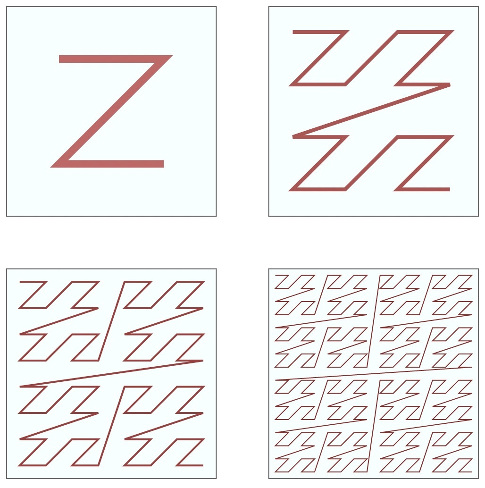
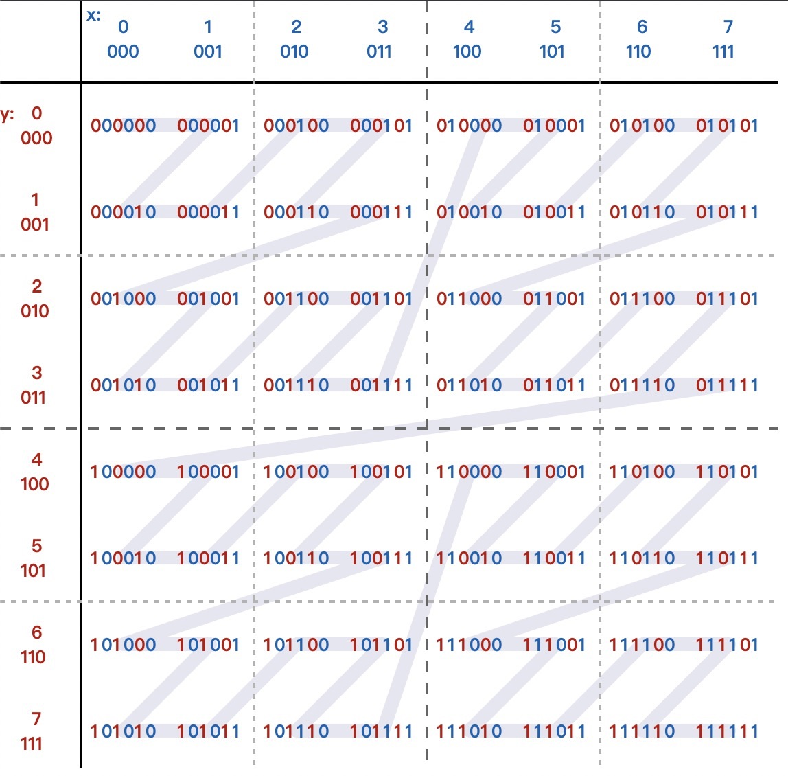
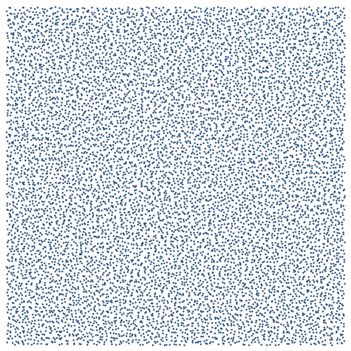
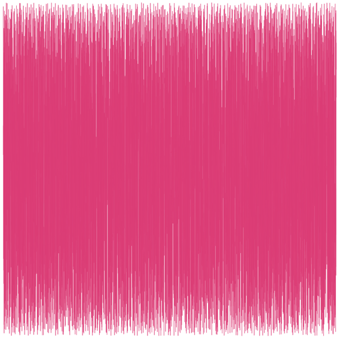
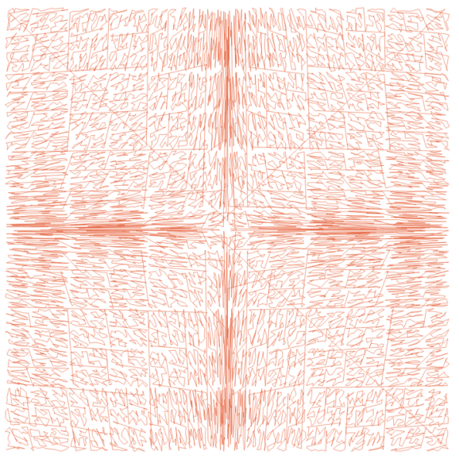
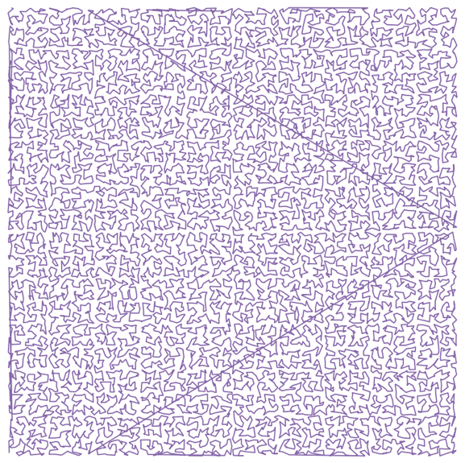

## PostgreSQL PostGIS 3 - 从min(x) 到 z-order 到 Hilbert Geometry Sorting - PostGIS空间排序算法优化     
                                                                                                                                                              
### 作者                                                                                                                                                              
digoal                                                                                                                                                              
                                                                                                                                                              
### 日期                                                                                                                                                              
2019-08-03                                                                                                                                                               
                                                                                                                                                              
### 标签                                                                                                                                                              
PostgreSQL , PostGIS , 空间排序 , 算法 , minx , Morton curve , Hilbert curve , 空间紧凑排序          
                                                                             
----                                                                                                                                                        
                                                                                                                                                          
## 背景         
PostGIS 是专业的空间插件，空间数据最常见的空间排序是怎么做的呢？  
  
1、2.4以前，空间排序使用的是x轴的最小值，算法粗糙。  
  
2、2.4开始引入了Z-order curve (Morton curve)排序算法，  
  
https://en.wikipedia.org/wiki/Z-order_curve  
  
  
     
  
  
3、3 开始，使用Hilbert curve代替了Z-order curve。  
  
https://en.wikipedia.org/wiki/Hilbert_curve  
  
  
  
## 例子  
1、创建离散点，如图  
  
```  
CREATE SEQUENCE points_seq;   
  
CREATE TABLE points AS   
SELECT (ST_Dump  
  ( ST_GeneratePoints(   
     ST_MakeEnvelope(-10000,-10000,10000,10000,3857),   
     10000)   
    )).geom AS geom,   
 nextval('points_seq') AS pk;  
```  
  
  
  
2、使用min(x轴)排序，聚合成线段，如图，可以清晰的看到排序后的线段是这些离散点根据min(x轴)的值顺序描绘出来的  
  
```  
SELECT ST_MakeLine(geom ORDER BY ST_X(geom)) AS geom   
FROM points;  
```  
  
  
  
3、使用Z-order_curve算法排序（使用PostGIS 2.5的版本排序即可），聚合成线段，如图，可以看到Z象限的顺序  
  
```  
SELECT ST_MakeLine(geom ORDER BY geom) AS geom   
FROM points;  
```  
  
  
  
4、使用Hilbert_curve（使用PostGIS 3排序），聚合成线段，如图，可以看到顺序和hilbert wiki描述一致  
  
```  
SELECT ST_MakeLine(geom ORDER BY geom) AS geom   
FROM points;  
```  
  
  
  
  
  
## 参考  
https://info.crunchydata.com/blog/waiting-for-postgis-3-hilbert-geometry-sorting  
  
https://en.wikipedia.org/wiki/Z-order_curve  
  
https://en.wikipedia.org/wiki/Hilbert_curve  
    
  
  
  
  
  
  
  
  
  
  
  
#### [digoal's PostgreSQL文章入口](https://github.com/digoal/blog/blob/master/README.md "22709685feb7cab07d30f30387f0a9ae")
  
  

  
  
  
  
  
  
  
  
#### [免费领取阿里云RDS PostgreSQL实例、ECS虚拟机](https://www.aliyun.com/database/postgresqlactivity "57258f76c37864c6e6d23383d05714ea")
  
